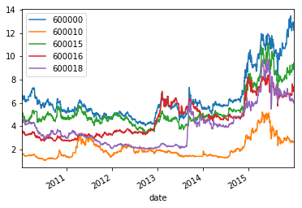
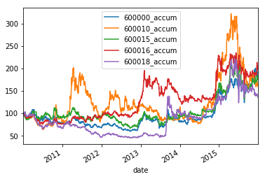
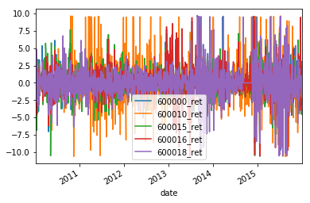
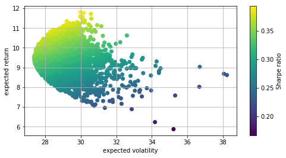
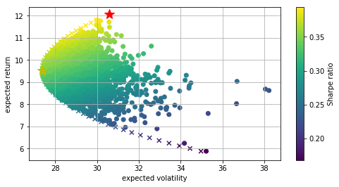
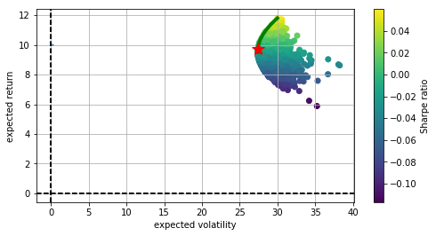

# 均值-方差投资组合理论（MPT）


```python
%matplotlib inline
```


```python
import datetime as dt
import matplotlib.pyplot as plt
import numpy as np
import pandas as pd
import scipy.optimize as sco
import tushare as ts
import scipy.interpolate as sci
```

## 数据准备

- 下载测试数据


```python
def DownloadTSData():
    """
    usage：从tushare下载5个股票日线数据
    """
    # 合并DataFrame时用于对齐的日期列，
    # 由于沪深300指数的日期是无间断的，可用沪深300的日期列作为对齐标准。
    hs300_date = sorted(set(ts.get_k_data(
        '399300', start='2010-01-01', end='2016-01-01')['date'].values))
    data = pd.DataFrame({'date': hs300_date})

    # 要下载数据的5个股票。
    symbols = ['600000', '600010', "600015", '600016', '600018']

    for sym in symbols:
        df = ts.get_k_data(sym, start='2010-01-01',
                           end='2016-01-01')[['date', 'close']]
        df.rename(columns={'close': sym}, inplace=True)

        # 日期必须唯一，日期若存在重复项则报错。
        if len(set(df['date'].values)) != len(df['date']):
            raise 'date\'s error'

        # 只取日期和收盘价，左键合并保证日期列对齐沪深300的日期列，保证日期的完整与唯一。
        data = pd.merge(data, df, on='date', how='left')

    # 有些个股数据有缺失，用前值填充。
    data.fillna(method='ffill', inplace=True)
    print(data.head(5))

    # 本地持久化。
    data.to_csv('d:\\CAPM5.csv', index=False)
```


```python
DownloadTSData()
```

             date  600000  600010  600015  600016  600018
    0  2010-01-04   6.704   1.618   5.072   3.570   4.418
    1  2010-01-05   6.755   1.611   5.200   3.633   4.426
    2  2010-01-06   6.622   1.614   5.010   3.561   4.380
    3  2010-01-07   6.473   1.576   4.906   3.466   4.258
    4  2010-01-08   6.546   1.583   4.939   3.502   4.273
    

- 读取本地数据


```python
def ReadCSVData():
    """
    usage：读取本地的CSV数据
    """
    df = pd.read_csv('d:\\CAPM5.csv')

    # 从CSV读取的日期是str格式的，需转为datetime64格式。
    df['date'] = df['date'].map(lambda x: dt.datetime.strptime(x, '%Y-%m-%d'))

    # 将日期作为索引列。
    df.set_index(keys='date', inplace=True)

    cols = df.columns

    # 添加5列累积收益率。
    for col in cols:
        df[col + '_accum'] = df[col] / df[col].ix[0] * 100

    # 添加5列log收益率。
    for col in cols:
        df[col + '_ret'] = np.log(df[col] / df[col].shift(1)) * 100

    # 计算log收益率后第一行产生NaN值，用0替代。
    df.fillna(value=0, inplace=True)
    print(df.head(5))
    return df
```


```python
df = ReadCSVData()
```

                600000  600010  600015  600016  600018  600000_accum  \
    date                                                               
    2010-01-04   6.704   1.618   5.072   3.570   4.418    100.000000   
    2010-01-05   6.755   1.611   5.200   3.633   4.426    100.760740   
    2010-01-06   6.622   1.614   5.010   3.561   4.380     98.776850   
    2010-01-07   6.473   1.576   4.906   3.466   4.258     96.554296   
    2010-01-08   6.546   1.583   4.939   3.502   4.273     97.643198   
    
                600010_accum  600015_accum  600016_accum  600018_accum  \
    date                                                                 
    2010-01-04    100.000000    100.000000    100.000000    100.000000   
    2010-01-05     99.567367    102.523659    101.764706    100.181077   
    2010-01-06     99.752781     98.777603     99.747899     99.139882   
    2010-01-07     97.404203     96.727129     97.086835     96.378452   
    2010-01-08     97.836836     97.377760     98.095238     96.717972   
    
                600000_ret  600010_ret  600015_ret  600016_ret  600018_ret  
    date                                                                    
    2010-01-04    0.000000    0.000000    0.000000    0.000000    0.000000  
    2010-01-05    0.757861   -0.433571    2.492341    1.749316    0.180914  
    2010-01-06   -1.988553    0.186047   -3.722271   -2.001735   -1.044752  
    2010-01-07   -2.275776   -2.382558   -2.097697   -2.704021   -2.824916  
    2010-01-08    1.121450    0.443179    0.670394    1.033304    0.351659  
    


```python
# 分组画图
df.iloc[:, :5].plot()
df.iloc[:, 5:10].plot()
df.iloc[:, 10:].plot()
plt.show()
```











## 投资组合可行域


```python
# 选择收益率进行组合优化
rets = df.iloc[:, 10:]

# 计算收益率的均值
means = rets.mean()

prets = []
pvols = []
noa = len(rets.columns)

for i in range(5000):
    # 生成随机权重并归一化
    weights = np.random.random(noa)
    weights /= np.sum(weights)

    # 权重确定后计算组合收益率均值和标准差
    mu = np.sum(means * weights) * 252
    sigma = np.sqrt(np.dot(weights.T, np.dot(rets.cov() * 252, weights)))

    prets.append(mu)
    pvols.append(sigma)

prets = np.array(prets)
pvols = np.array(pvols)

# 画出投资组合可行域
plt.figure(figsize=(8, 4))
plt.scatter(pvols, prets, c=prets / pvols, marker='o')
plt.grid(True)
plt.xlabel('expected volatility')
plt.ylabel('expected return')
plt.colorbar(label='Sharpe ratio')
```


    <matplotlib.colorbar.Colorbar at 0x1aaed470>





## 投资组合有效前沿


```python
def statistics(weights):
    """
    usage：输入权重输出组合收益率、组合标准差、组合夏普比率
    """
    weights = np.array(weights)
    pret = np.sum(means * weights) * 252
    pvol = np.sqrt(np.dot(weights.T, np.dot(rets.cov() * 252, weights)))
    return np.array([pret, pvol, pret / pvol])
```


```python
def min_func_sharpe(weights):
    """
    usage：计算最大夏普比率，或者说最小化负的夏普比率
    """
    return -statistics(weights)[2]
```


```python
cons = ({'type': 'eq', 'fun': lambda x: np.sum(x) - 1})
bnds = tuple((0, 1) for x in range(noa))
opts = sco.minimize(min_func_sharpe, noa *
                    [1. / noa, ], method='SLSQP', bounds=bnds, constraints=cons)
```


```python
def min_func_variance(weights):
    """
    usage：计算标准差
    """
    return statistics(weights)[1] ** 2
```


```python
optv = sco.minimize(min_func_variance, noa *
                    [1. / noa, ], method='SLSQP', bounds=bnds, constraints=cons)
```


```python
def min_func_port(weights):
    return statistics(weights)[1]
```


```python
trets = np.linspace(np.min(prets), np.max(prets), 50)
tvols = []
bnds = tuple((0, 1) for x in weights)

for tret in trets:
    cons = ({'type': 'eq', 'fun': lambda x: statistics(x)[0] - tret},
            {'type': 'eq', 'fun': lambda x: np.sum(x) - 1})
    res = sco.minimize(min_func_port, noa * [1. / noa, ],
                       method='SLSQP', bounds=bnds, constraints=cons)
    tvols.append(res['fun'])

tvols = np.array(tvols)
```


```python
plt.figure(figsize=(8, 4))
plt.scatter(pvols, prets, c=prets / pvols, marker='o')  # 投资组合可行域
plt.scatter(tvols, trets, c=trets / tvols, marker='x')  # 投资组合有效边界
plt.plot(statistics(opts['x'])[1], statistics(opts['x'])[
         0], 'r*', markersize=15.0)  # 最大夏普比率的投资值
plt.plot(statistics(optv['x'])[1], statistics(
    optv['x'])[0], 'y*', markersize=15.0)  # 最小方差的投资组合
plt.grid(True)
plt.xlabel('expected volatility')
plt.ylabel('expected return')
plt.colorbar(label='Sharpe ratio')
```


    <matplotlib.colorbar.Colorbar at 0x1ac85fd0>





```python
ind = np.argmin(tvols)
evols = tvols[ind:]
erets = trets[ind:]
tck = sci.splrep(evols, erets)
```


```python
def f(x):
    return sci.splev(x, tck, der=0)
```


```python
def df(x):
    return sci.splev(x, tck, der=1)
```


```python
def equations(p, rf=10):
    eq1 = rf - p[0]
    eq2 = rf + p[1] * p[2] - f(p[2])
    eq3 = p[1] - df(p[2])
    return eq1, eq2, eq3
```


```python
opt = sco.fsolve(equations, [10, 0.25, 0.15])
```


```python
plt.figure(figsize=(8, 4))
plt.scatter(pvols, prets, c=(prets - 10) / pvols, marker='o')  # 投资组合可行域
plt.plot(evols, erets, 'g', lw=4.0)  # 投资组合有效边界
# capital market line
cx = np.linspace(0.0, 0.3, 50)
plt.plot(cx, opt[0] + opt[1] * cx, lw=1.5)
plt.plot(opt[2], f(opt[2]), 'r*', markersize=15.0)
plt.grid(True)
plt.axhline(0, color='k', ls='--', lw=2.0)
plt.axvline(0, color='k', ls='--', lw=2.0)
plt.xlabel('expected volatility')
plt.ylabel('expected return')
plt.colorbar(label='Sharpe ratio')
```


    <matplotlib.colorbar.Colorbar at 0x1b15ba90>





```python

```
